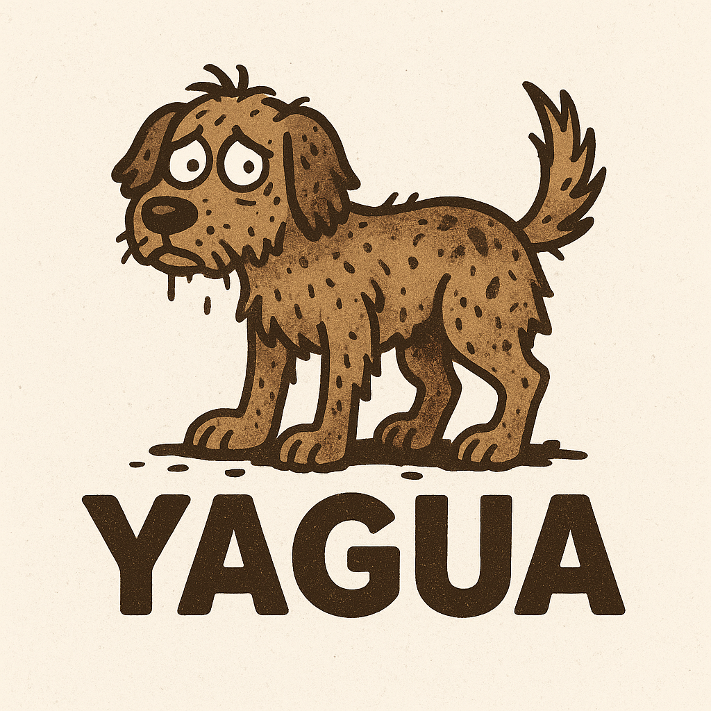

<div align="center">



# Yagua

**A tool for collecting and managing test information from pytest-based projects**

[](https://www.python.org/downloads/)
[](LICENSE)

</div>

---

## Table of Contents

- [About](#about)
- [Features](#features)
- [Installation](#installation)
- [Quick Start](#quick-start)
- [Usage](#usage)
  - [CLI](#cli)
  - [Programmatic API](#programmatic-api)
- [Development](#development)
- [Documentation](#documentation)
- [License](#license)

---

## About

Yagua is a Python package that helps you collect, store, and manage test information from pytest-based projects using a SQLite database. Part of the **qa_entropy** research workspace.

## Features

- Collect test information from pytest projects
- Store test metadata in SQLite database (one cache file per project)
- Track test coverage information
- CLI and programmatic API
- Automatic project creation and updates

---

## Installation

```bash
# Install in development mode
pip install -e .

# Install with development dependencies (pytest, tox, mutmut, cosmic-ray)
pip install -e ".[dev]"
```

---

## Quick Start

```bash
# Collect tests from a project
yagua --cache qa.sqlite collect /path/to/project

# Show project information
yagua --cache qa.sqlite info /path/to/project

# List all tests
yagua --cache qa.sqlite list-tests /path/to/project
```

---

## Usage

### CLI

```bash
# Show help
yagua --help

# Collect tests from a project
yagua --cache qa.sqlite collect /path/to/project

# Collect tests with custom name and description
yagua --cache qa.sqlite collect /path/to/project --name "my_project" --description "My project"

# Show project information
yagua --cache qa.sqlite info /path/to/project

# List tests for a project
yagua --cache qa.sqlite list-tests /path/to/project
```

### Programmatic API

```python
from yagua import Project, PytestSuite

# Project is automatically created/updated in the database
with Project(
    cache_path="qa.sqlite",
    name="my_project",
    path="/path/to/project",
    description="My awesome project"
) as proj:
    # Collect and save tests from pytest suite
    suite = PytestSuite("/path/to/project")
    saved, updated = proj.collect_tests(suite)
    print(f"Collected {saved + updated} tests")

    # Add individual tests
    test, created = proj.add_test(
        file="test_file.py",
        suite="TestSuite",
        test="test_example",
        coverage=85.5
    )

    # List all tests
    tests = proj.list_tests()

    # Access project info
    print(f"Project: {proj.project.name}")

# Alternative: Use from_path constructor
with Project.from_path(
    project_path="/path/to/project",
    cache_path="qa.sqlite"
) as proj:
    suite = PytestSuite("/path/to/project")
    proj.collect_tests(suite)
```

---

## Development

```bash
# Run tests
pytest

# Run tests with coverage
pytest --cov=yagua --cov-report=term-missing

# Run mutation testing
mutmut run

# Run tox
tox
```

---

## Documentation

See [CLAUDE.md](CLAUDE.md) for detailed architecture and development documentation.

## License

MIT License - See [LICENSE](LICENSE) for details.

---

<div align="center">
<sub>Logo created with ChatGPT</sub>
</div>