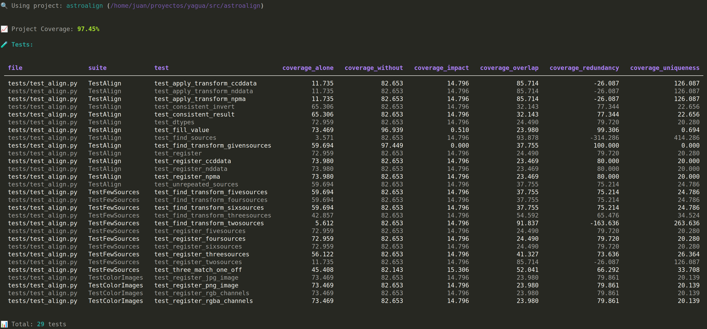

<div align="center">


# Yagua

**Test collection and coverage analysis for pytest-based projects**

[](https://www.python.org/downloads/)
[](LICENSE)

</div>

---

## Table of Contents

- [About](#about)
- [Features](#features)
- [Installation](#installation)
- [Quick Start](#quick-start)
- [Usage](#usage)
  - [CLI Commands](#cli-commands)
  - [Programmatic API](#programmatic-api)
- [Coverage Metrics](#coverage-metrics)
  - [Basic Metrics](#basic-metrics)
  - [Calculated Metrics](#calculated-metrics)
  - [Interpreting Results](#interpreting-results)
  - [Use Cases](#use-cases)
- [Development](#development)
- [Documentation](#documentation)
- [License](#license)

---

## 📖 About

Yagua is a Python package for collecting, storing, and analyzing test information from pytest-based projects. It uses a dedicated work directory containing an SQLite database (yagua.db) to store test metadata and coverage metrics, enabling efficient analysis without repeated execution of expensive coverage measurements.

**Key Design Principle**: Yagua operates on a **caching-first** model. Once data is collected (tests, coverage metrics), it is cached and never recalculated unless explicitly requested using flags like `--force` or `-f`. This ensures fast operations and prevents unnecessary re-execution of expensive coverage analysis.

## ✨ Features

- **Test Discovery**: Automatic collection of test information from pytest projects
- **SQLite Storage**: Dedicated work directory with yagua.db containing all test metadata
- **Coverage Analysis**: Project-level and per-test coverage tracking with advanced metrics
- **Dual Interface**: Both CLI and programmatic Python API
- **Execution History**: Complete audit trail of all operations with command tracking
- **Error Handling**: Comprehensive error logging even for failed executions
- **Flexible Recollection**: Force recalculation of any cached data on demand

---

## 📦 Installation

```bash
# Install in development mode
pip install -e .

# Install with development dependencies (pytest, coverage, pytest-cov)
pip install -e ".[dev]"
```

After installation, the `yagua` command will be available globally.

---

## 🚀 Quick Start

```bash
# Create a new yagua project (creates work directory with yagua.db)
yagua create-project /path/to/project _yagua_work_

# Collect tests from the project
yagua collect-tests _yagua_work_

# Show project information
yagua info _yagua_work_

# List all tests with coverage metrics
yagua list-tests _yagua_work_

# Collect comprehensive coverage data
yagua collect-coverage _yagua_work_
```

---

## 💻 Usage

### 🖥️ CLI Commands

#### Project Management

```bash
# Show all available commands
yagua --help

# Create new project with custom work directory
yagua create-project /path/to/project my_work_dir \
  --name "My Project" \
  --description "Project description"

# Display project information
yagua info my_work_dir
```

#### Test Collection

```bash
# Collect tests (cached after first run)
yagua collect-tests my_work_dir

# Force recollection of tests
yagua collect-tests my_work_dir --force
yagua collect-tests my_work_dir -f  # Short form
```

#### Test Listing

```bash
# List tests (compact view)
yagua list-tests my_work_dir

# Show all columns including IDs and timestamps
yagua list-tests my_work_dir --long
yagua list-tests my_work_dir -l  # Short form
```

#### Coverage Collection

```bash
# Collect project + per-test coverage (cached)
yagua collect-coverage my_work_dir

# Force recalculation of all coverage metrics
yagua collect-coverage my_work_dir --force
yagua collect-coverage my_work_dir -f  # Short form
```

**Note**: Coverage collection can be time-consuming for large test suites as it runs each test individually and then all tests except each one. For N tests, this results in approximately 2N+1 test runs.

#### Export and Import

```bash
# Export work directory to archive file
yagua export my_work_dir
yagua export my_work_dir --output backup.tar.gz

# Supported formats: .zip, .tar, .tar.gz (.tgz), .tar.bz2 (.tbz2), .tar.xz (.txz)
```

**Note**: Exported archives can be shared, backed up, or opened using the `read_archive()` function in the Python API.

### 🐍 Programmatic API

Yagua provides a complete Python API for integration into scripts and tools:

```python
from yagua import Project, read_dir, read_archive

# Create new project (creates work_dir with yagua.db inside)
proj = Project.from_project_info(
    name="my_project",
    path="/path/to/project",
    work_dir="my_work_dir",
    description="Optional description"
)

# Open existing project
proj = Project(work_dir="my_work_dir")
# Or use the convenience function
proj = read_dir("my_work_dir")

# Open project from an archive file
proj = read_archive("my_project.zip")

# Collect tests
saved_count, updated_count = proj.collect_tests()

# Get tests as DataFrame
tests_df = proj.get_tests_dataframe()

# Collect coverage
total_coverage = proj.collect_coverage()
test_coverage_alone = proj.collect_coverage_for_test("test_id")
coverage_without = proj.collect_coverage_without_test("test_id")

# Access project properties
print(f"Name: {proj.name}")
print(f"Path: {proj.path}")
print(f"Work Dir: {proj.work_dir}")
print(f"Database: {proj.db_path}")
print(f"Coverage: {proj.coverage}")

# Close when done
proj.close()
```

For architectural details and system design, see [ARCHITECTURE.md](ARCHITECTURE.md).

---

## 📊 Coverage Metrics

Yagua provides advanced coverage metrics to analyze test quality, redundancy, and unique contributions. All metrics are automatically calculated when running `yagua collect-coverage`.

### Basic Metrics

These are directly measured by running pytest with coverage:

| Metric | Description |
|--------|-------------|
| **Coverage Alone** | Coverage when running only this test in isolation |
| **Coverage Without** | Coverage when running all tests except this one |
| **Total Coverage** | Overall project coverage with all tests |

### Calculated Metrics

Yagua automatically derives four additional metrics from the basic measurements:

#### 1. Coverage Impact

**Formula**: `total_coverage - coverage_without`

**Meaning**: The unique coverage contribution of this test. How much coverage would be lost if you removed this test.

**Interpretation**:
- **High Impact** (close to coverage_alone): Test provides unique coverage
- **Low Impact** (close to 0): Test coverage is mostly redundant
- **Negative Impact**: Should never occur with a proper test suite

#### 2. Coverage Overlap

**Formula**: `coverage_alone - coverage_impact`
(Alternative: `coverage_without + coverage_alone - total_coverage`)

**Meaning**: Amount of coverage this test shares with other tests. The portion of this test's coverage that is NOT unique to it.

**Interpretation**:
- **High Overlap**: Code tested is mostly already covered by other tests
- **Low Overlap**: Code tested is exercised almost uniquely by this test

#### 3. Coverage Uniqueness (%)

**Formula**: `(coverage_impact / coverage_alone) × 100`

**Meaning**: Percentage of this test's coverage that is unique.

**Interpretation**:
- **100%**: All coverage is unique - critical test
- **50%**: Half unique, half redundant
- **0%**: Completely redundant test

#### 4. Coverage Redundancy (%)

**Formula**: `((coverage_alone - coverage_impact) / coverage_alone) × 100`

**Meaning**: Percentage of this test's coverage that is redundant.

**Interpretation**:
- **0%**: No redundant coverage - completely unique
- **50%**: Half redundant
- **100%**: Completely redundant - all coverage duplicated elsewhere

### Interpreting Results

The calculated metrics are available via the Python API using `proj.get_test(test_id)` which returns a pandas Series with all metrics, or displayed in the CLI using `yagua list-tests my_work_dir`:



### Use Cases

**Identify Critical Tests**
Tests with high uniqueness (>80%) are critical for maintaining coverage. Removing them would significantly reduce overall coverage.

**Find Redundant Tests**
Tests with high redundancy (>90%) are candidates for removal or refactoring. They test code already covered by other tests.

**Optimize Test Suite**
Balance coverage with test count by removing highly redundant tests while preserving high-uniqueness tests.

**Code Review**
Use impact metrics to justify new tests. Tests with high impact provide valuable additions to the suite.

**Refactoring Guidance**
Tests with high overlap indicate areas where code is well-tested, making refactoring safer.

---

## 🔧 Development

```bash
# Run tests
pytest

# Run tests with coverage
pytest --cov=yagua --cov-report=term-missing

# Format code (PEP 8 style, max 79 columns)
black -l 79 .
```

---

## 📚 Documentation

- **[ARCHITECTURE.md](ARCHITECTURE.md)** - System architecture, components, data flow, and design patterns
- **[CLAUDE.md](CLAUDE.md)** - Development guide with API reference and coding conventions

---

## 📄 License

MIT License - See [LICENSE](LICENSE) for details.

---

<div align="center">
<sub>Logo created with ChatGPT</sub>
</div>
